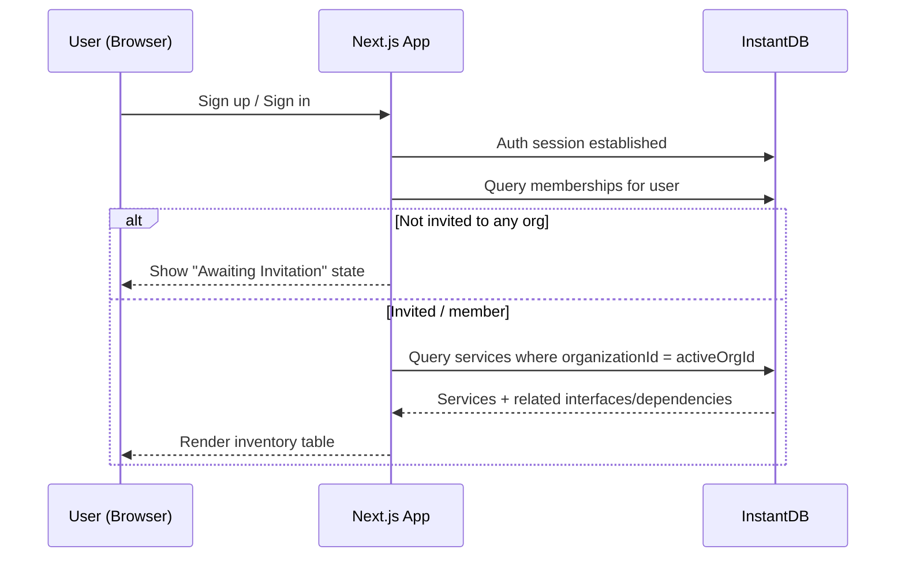
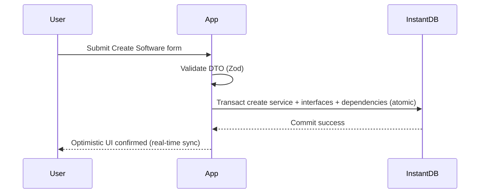

# Architecture Document — Deploy Index (Deployed Software Inventory Platform)

## 1. Introduction

* **Project Name:** Deploy Index — Deployed Software Inventory Platform
* **Document Version:** 1.0
* **Date:** 2026-01-04
* **Purpose:**
  This document defines the target **architecture** for Deploy Index: a Next.js 16 / React 19 internal application backed by **InstantDB** with **Better Auth** for authentication and an **invitation-gated, organization-scoped** authorization model. The platform centralizes an inventory of **any deployed software** (not limited to APIs), enables role-based CRUD operations, provides a high-quality UX, and supports Excel export.

---

## 2. Goals

### Architectural Goals

* **Security and Governance:** enforce invitation-gated visibility and role-based access at the data-permissions layer (not just UI).
* **Maintainability:** schema-first domain model, centralized permissions, typed queries and transactions, predictable module boundaries.
* **Performance:** fast inventory browsing with virtualized tables and indexed queries; low latency for common reads/writes.
* **Scalability:** organization-scoped partitioning, index-driven filtering/sorting, and patterns that scale with org/user growth.
* **Reliability and Data Integrity:** transactional composite writes, uniqueness constraints, controlled vocabularies, safe deletion semantics.

### Business Goals

* Replace fragmented Excel + YAML with a **single source of truth**.
* Reduce contributor friction via forms and UX patterns suited for developers and DevOps.
* Provide cross-team visibility and sharing via export.
* Prevent internal data leakage through invitation-based access.

---

## 3. System Overview

### 3.1 System Context Diagram

```mermaid
flowchart LR
  U[Internal Users\n(Self-signup)] -->|Auth| A[Better Auth UI + Session]
  A -->|Signed-in user| W[Deploy Index Web App\n(Next.js)]
  W -->|InstaQL Queries / Transactions| DB[(InstantDB)]
  Admin[Org Admin/Owner] -->|Invite Members| W
  W -->|Export XLSX| X[Excel File Download]
```

**Key context points**

* Users can self-register, but cannot see org inventory until invited.
* All inventory data reads/writes go through InstantDB with permissions enforced.

---

### 3.2 Component Diagram

```mermaid
flowchart TB
  subgraph Client["Client (Browser)"]
    UI[UI Components\nRadix + Tailwind]
    Pages[Next.js App Router Pages\n/dashboard/*]
    Hooks[Typed Data Hooks\nuseServices/useService/...]
    AuthState[Instant Auth State\nuseAuth()]
    ExportUI[Export Trigger + Progress UI]
  end

  subgraph App["Next.js Runtime"]
    Middleware[Route Protection\nPublic vs Protected]
    ServerExport[Optional: Export Route\nXLSX streaming]
    InviteFlow[Invitation Acceptance Pages]
  end

  subgraph Instant["InstantDB"]
    Schema[instant.schema.ts]
    Perms[instant.perms.ts]
    Data[(Entities + Links)]
  end

  UI --> Pages
  Pages --> Hooks
  Hooks --> InstantSDK[@instantdb/react client]
  AuthState --> Pages
  InstantSDK --> Instant
  Middleware --> Pages
  ExportUI -->|Client export| Pages
  ExportUI -->|Server export (optional)| ServerExport
  ServerExport --> InstantAdmin[@instantdb/admin (optional)]
  InstantAdmin --> Instant
  Schema --> Data
  Perms --> Data
```

---

### 3.3 Deployment Diagram

```mermaid
flowchart LR
  Dev[Developer Machine] -->|git push| CI[CI Pipeline]
  CI -->|build| Host[Hosting Platform\n(Vercel or equivalent)]
  Host -->|serves| Browser[User Browser]
  Browser -->|HTTPS| Host
  Browser -->|HTTPS| InstantCloud[InstantDB Cloud]
  Host -->|optional server route calls| InstantCloud
```

**Deployment characteristics**

* Primarily client-driven InstantDB usage.
* Optional server route for streaming XLSX exports (recommended for very large org datasets).

---

## 4. Components

### 4.1 Next.js Web Application (App Router)

* **Description:** Main web application providing public pages (landing/sign-in/sign-up) and protected dashboard pages for inventory management.
* **Responsibilities:**

  * Render UI and handle navigation.
  * Enforce route-level authentication (public vs protected).
  * Provide organization-aware UX and empty states (e.g., “Awaiting invitation”).
* **Interfaces:**

  * UI routes: `/`, `/auth/sign-in`, `/auth/sign-up`, `/dashboard/*`
* **Dependencies:**

  * Better Auth UI
  * InstantDB React SDK (`@instantdb/react`)
  * UI component libraries (Radix, Tailwind)
* **Implementation Details:**

  * Use `db.useAuth()` at top-level app layout/provider to avoid conditional hooks.
  * Protected routes redirect unauthenticated users to sign-in.
  * Authenticated but non-member users see invitation-needed state.

---

### 4.2 InstantDB Client Data Layer (InstaQL + Transactions)

* **Description:** Data access layer using InstantDB queries and transactions from the browser.
* **Responsibilities:**

  * Read inventory using indexed, org-scoped queries.
  * Write inventory via atomic transactions.
  * Enforce permissions centrally (via Instant perms).
* **Interfaces:**

  * Query interface: `db.useQuery({ ... })`
  * Transaction interface: `db.transact([...])`
* **Dependencies:**

  * `instant.schema.ts` for typed models
  * `instant.perms.ts` for authorization enforcement
* **Implementation Details:**

  * Ensure all filter/sort fields are indexed (Instant requirement).
  * Use only supported `where` operators (`$ilike`, `$in`, comparisons, `and/or`).

---

### 4.3 Better Auth (Authentication + UI)

* **Description:** Authentication layer for self-signup and sign-in experience.
* **Responsibilities:**

  * User session establishment and management.
  * Provide UI flows for registration and login.
* **Interfaces:**

  * Auth UI routes/pages: `/auth/*`
  * Session state accessible via the app’s auth integration.
* **Dependencies:**

  * Better Auth packages + InstantDB integration adapters
* **Implementation Details:**

  * Self-registration creates a user identity but not org membership.
  * Invitation acceptance grants membership (visibility).

---

### 4.4 Organization & Membership Management Module

* **Description:** Allows admin/owner users to manage organization details and membership.
* **Responsibilities:**

  * Create and manage invitations.
  * Manage member roles and removal.
* **Interfaces:**

  * `/dashboard/organization`, `/dashboard/members`, `/dashboard/invitations`
* **Dependencies:**

  * InstantDB entities for `organizations`, `members`, `invitations`
  * Permission rules restricting access to admin/owner
* **Implementation Details:**

  * Invitation flow:

    * Create invitation (admin/owner only)
    * Accept invitation (invited user)
    * Membership created, inventory becomes visible

---

### 4.5 Inventory UI (Table + Forms)

* **Description:** Core UX for viewing and editing deployed software inventory.
* **Responsibilities:**

  * Display table with search/filter/sort.
  * Provide create/edit forms with validation.
  * Provide detail view for a software record.
* **Interfaces:**

  * `/dashboard/services`
  * `/dashboard/services/[id]`
* **Dependencies:**

  * React Hook Form + Zod for validation
  * TanStack Table + Virtual for large datasets
* **Implementation Details:**

  * Virtualize rows > 100.
  * Debounce search inputs to reduce query churn.
  * Avoid nested pagination inside relations (Instant constraint).
  * Validation rules enforce controlled vocabularies and uniqueness at the UI/service layer.

---

### 4.6 Export Module (Excel)

* **Description:** Generates an Excel file from the inventory view.
* **Responsibilities:**

  * Create analysis-friendly export (normalized rows).
  * Apply current filters/search to export dataset.
* **Interfaces:**

  * UI trigger: “Export to Excel”
  * Optional server endpoint: `/dashboard/services/export.xlsx`
* **Dependencies:**

  * Inventory query results
  * Optional server route using `@instantdb/admin` for large exports
* **Implementation Details:**

  * Export format:

    * **One row per interface**
    * Software fields repeated
    * Dependencies as semicolon-separated string
    * Software with no interfaces exported as one row with empty interface columns

---

## 5. Data Architecture

### 5.1 Data Model

Core entities:

* `services` (software inventory record)
* `serviceInterfaces` (deployment access points; domain/env/branch/runtime)
* `serviceDependencies` (declared dependencies)
* `organizations`, `members`, `invitations` (governance)

Controlled vocabularies:

* `env`: production | staging | development
* `runtimeType`: ec2 | vm | k8s | lambda | container | paas | unknown

Uniqueness constraints:

* `(organizationId, service.name)`
* `(serviceId, interface.domain)`
* `(serviceId, dependencyName)`

### 5.2 Data Storage

* Primary storage: **InstantDB**
* Schema and permissions are committed in-repo and pushed via Instant CLI.

### 5.3 Data Flow



Write flow (create service):



---

## 6. Security

### 6.1 Security Requirements

* Authentication required for all dashboard routes.
* Org inventory visibility requires explicit membership (invitation).
* RBAC enforcement for create/update/delete and membership operations.
* Prevent horizontal privilege escalation across orgs.
* Input validation for all user-supplied fields (especially URLs).

### 6.2 Security Measures

* **InstantDB permissions (policy-as-code):** membership gating + role checks.
* **Least privilege roles:** viewer/editor/admin/owner; delete restricted.
* **Validation layer:** Zod schemas; enforce required repository; enforce enums.
* **Invitation security:** single-use tokens, expiration policy (implementation detail), and acceptance binding to identity.

---

## 7. Scalability

### 7.1 Scalability Requirements

* Support orgs with 1,000+ software records and multiple interfaces per software.
* Support concurrent usage across multiple teams.
* Maintain responsiveness for search/filter and export.

### 7.2 Scalability Strategy

* **Org-scoped partitioning:** all queries include `organizationId`.
* **Index-first design:** index every field used in filtering/sorting:

  * services: organizationId, name, owner, repository, createdAt, updatedAt
  * interfaces: serviceId, domain, env, branch, runtimeType
  * dependencies: serviceId, dependencyName
* **UI virtualization:** avoid DOM blow-ups.
* **Lazy detail loading:** load deep relations on-demand if needed.

---

## 8. Performance

### 8.1 Performance Requirements

* Inventory list query: < 200ms for 1,000 services (excluding network).
* Detail query: < 100ms (excluding network).
* First meaningful paint: < 2s for dashboard entry point.
* Export: acceptable time for org size (server route recommended for large sets).

### 8.2 Performance Optimization

* Virtualized table rendering for large lists.
* Debounced search with `$ilike` rather than unsupported operators.
* Avoid conditional hook usage; keep render paths stable.
* Prefer summary fields/counts on list view to reduce nested payload size (if needed).

---

## 9. Technology Stack

* **Framework:** Next.js 16 (App Router)
* **Language:** TypeScript
* **UI:** Tailwind CSS, Radix UI, lucide-react, framer-motion
* **Data:** InstantDB (`@instantdb/react`, `@instantdb/admin`)
* **Auth:** Better Auth + Better Auth UI
* **Forms:** TanStack Form + Zod
* **Table:** TanStack Table + TanStack Virtual
* **Analytics/Monitoring (baseline):** Vercel Analytics (existing)

---

## 10. Deployment

* **Environment:** Hosted web deployment (Vercel or equivalent).
* **Process:**

  * CI builds Next.js app.
  * Environment variables configured:

    * Instant App ID
    * Instant Admin token (only for admin scripts / server routes)
    * Auth provider settings (Better Auth)
* **Tools:**

  * Instant CLI for schema/perms pushes:

    * `push schema`
    * `push perms`
* **Data migrations:** none from YAML/Excel in MVP.

---

## 11. Monitoring

### Monitoring Approach

* Client-side error tracking and performance monitoring:

  * Route transitions
  * Query errors
  * Export failures
* Data health metrics:

  * # services per org
  * % services with at least one interface
  * % interfaces missing env / runtime (if optional)

### Metrics (Minimum)

* Auth success/fail rate
* Invitation acceptance conversion
* Query latency (p50/p95)
* Export execution time
* Permission-denied incidents (signals UX or role misconfiguration)

---

## 12. Open Issues

1. **Invitation acceptance mechanics:** token + link vs in-app acceptance only.
2. **Cascade delete feasibility:** confirm link cardinalities to comply with Instant’s cascade limitations.
3. **Export execution mode:** client-only vs server-streamed XLSX for large datasets.
4. **Organization creation policy:** any authenticated user can create org vs restricted to admins (business policy).

---

## 13. Future Considerations

* Excel import with validation and conflict resolution
* Dependency graph relationships (service-to-service)
* Infrastructure discovery to populate runtime fields automatically
* SCM integration to auto-populate repository metadata
* Full audit logs and record versioning
* Data quality dashboard and enforcement rules (warnings vs hard fails)

---

## 14. Glossary

* **InstaQL:** InstantDB query interface (`db.useQuery`)
* **InstaML:** InstantDB transaction/write interface (`db.tx` + `db.transact`)
* **RBAC:** Role-Based Access Control
* **SSOT:** Single Source of Truth
* **Interface:** Deployment access point (domain) for a software record
* **Runtime Locator:** (type, id) pair identifying where software runs
* **Invitation-gated visibility:** users can sign up but cannot view org data without membership